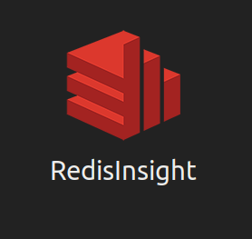
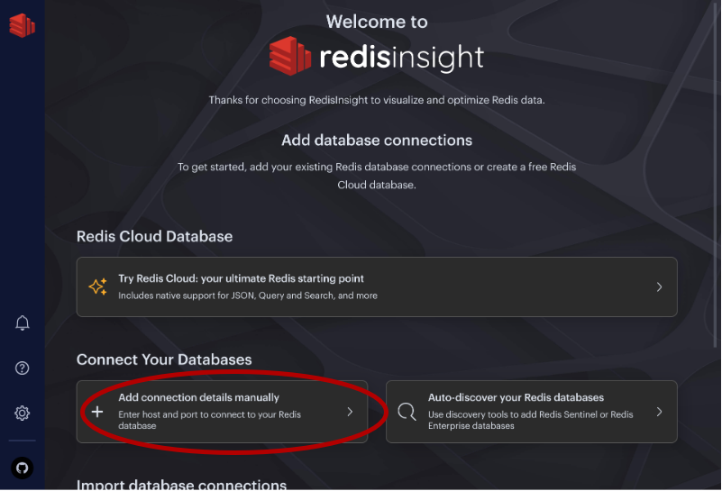
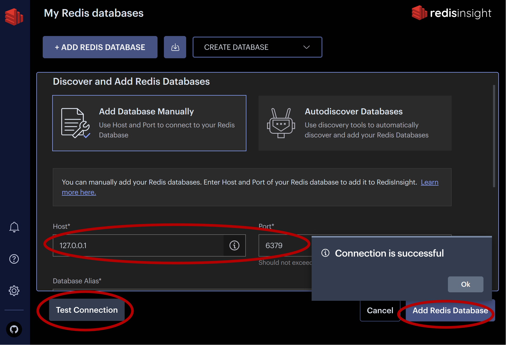
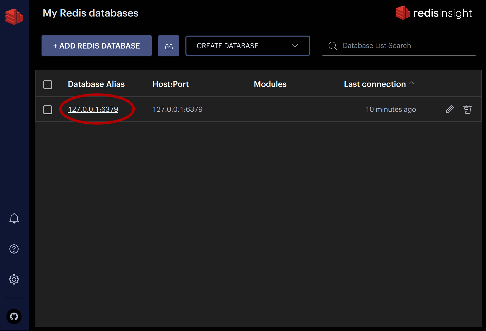
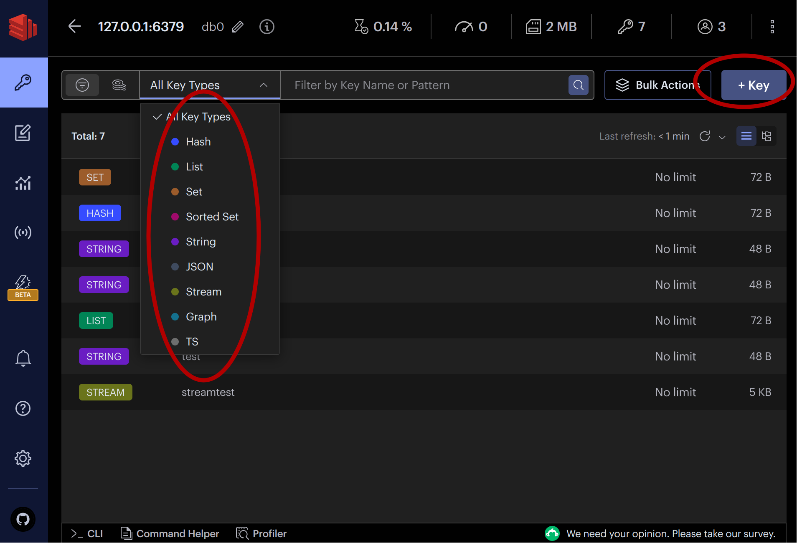
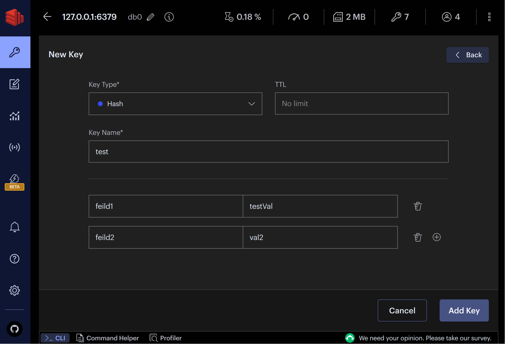
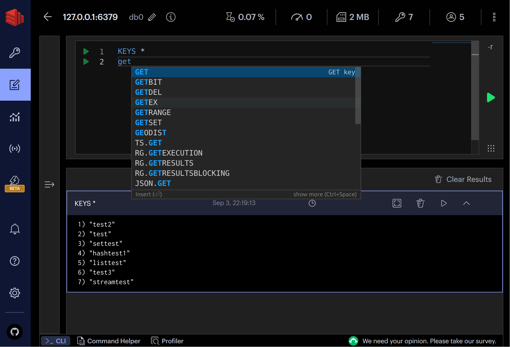
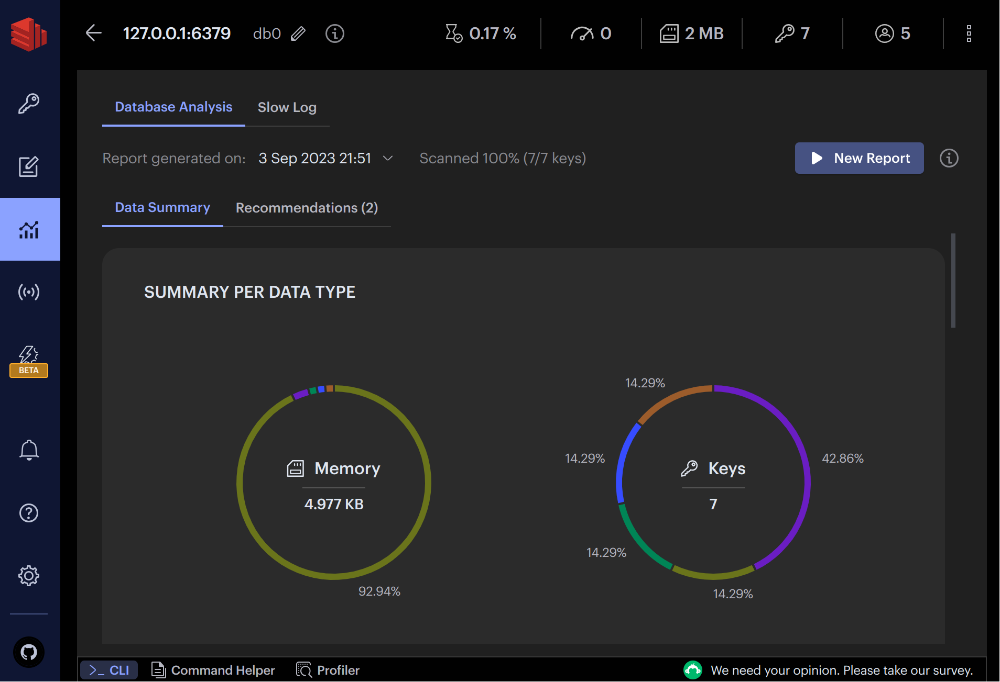
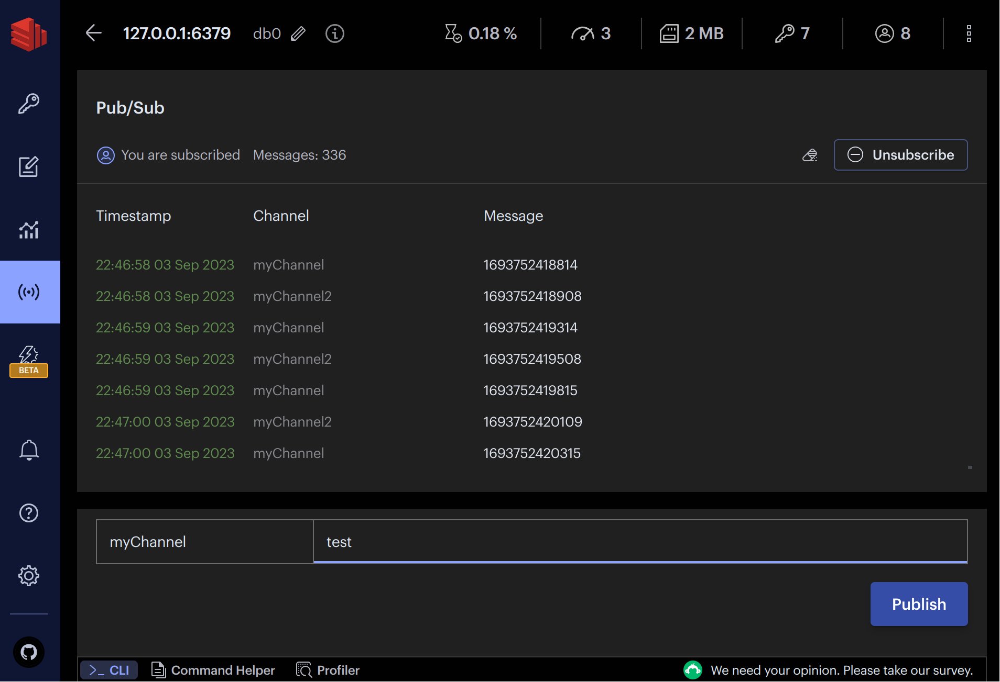

# 体验 Redis 官方可视化工具 RedisInsight<!-- omit in toc -->

RedisInsight 用于可视化和优化 Redis 或 Redis Stack 中的数据，允许在桌面 GUI 客户端中进行基于 GUI 和 CLI 的交互。

## 目录<!-- omit in toc -->

- [1. 下载和安装](#1-下载和安装)
- [2. 连接数据库](#2-连接数据库)
- [3. 数据浏览](#3-数据浏览)
- [4. 工作台](#4-工作台)
- [5. 分析工具](#5-分析工具)
- [6. 发布订阅](#6-发布订阅)

## 1. 下载和安装

[RedisInsight 官方下载页面>>](https://redis.com/redis-enterprise/redis-insight)

安装：

```sh
$ sudo dpkg -i RedisInsight-v2-linux-amd64.deb

正在选中未选择的软件包 redisinsight。
(正在读取数据库 ... 系统当前共安装有 235479 个文件和目录。)
准备解压 RedisInsight-v2-linux-amd64.deb  ...
正在解压 redisinsight (2.32.0-91313) ...
正在设置 redisinsight (2.32.0-91313) ...
正在处理用于 hicolor-icon-theme (0.17-2) 的触发器 ...
正在处理用于 mailcap (3.70+nmu1ubuntu1) 的触发器 ...
正在处理用于 gnome-menus (3.36.0-1ubuntu3) 的触发器 ...
正在处理用于 desktop-file-utils (0.26-1ubuntu3) 的触发器 ...
```

安装成功后显示如下图标：



## 2. 连接数据库

1. 打开 RedisInsight，选择手动添加连接：



2. 填写连接信息，测试连接，并保存：




## 3. 数据浏览

可以通过数据类型、键名、模式匹配来检索数据；点击右上角的添加按钮进入添加页面：




## 4. 工作台

可以在工作台直接执行命令，会自动根据输入的内容智能提示和补全：



## 5. 分析工具

在分析工具页面，可以通过多种维度查看当前数据的统计信息：



## 6. 发布订阅

在发布订阅页面，可以实时订阅消息，或发布消息：


